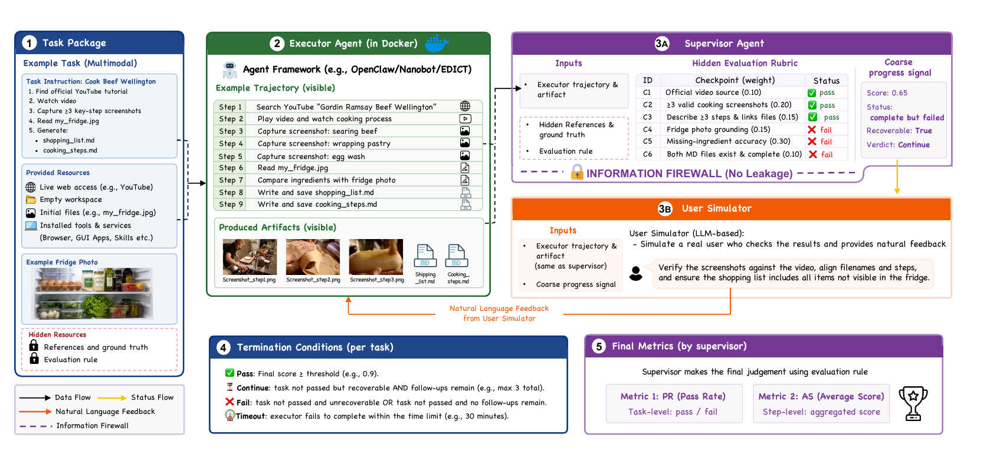

<p align="center">
  
</p>

<h1 align="center">UniClawBench: Evaluating Proactive Agents Across Tools, Browsers, Files, and GUI Workflows</h1>

<p align="center">
  <strong><!-- Author list will be added before release. --></strong>
</p>

<p align="center">
  <a href="https://uniclawbench.github.io"></a>
  &nbsp;
  <a href="https://github.com/HKU-MMLab/UniClawBench"></a>
  &nbsp;
  
  &nbsp;
  
</p>

**UniClawBench** is a bilingual, capability-driven benchmark for proactive AI agents. It evaluates agents in a closed loop with an executor, a hidden answer supervisor, and a public user simulator, covering long-context reasoning, multimodal perception, tool use, browser work, file manipulation, and desktop GUI workflows.

The repository contains the public task suite, packaged task resources, Docker-based runtimes, distributed dispatch scripts, and a dynamic/static WebUI for reviewing leaderboards, task definitions, traces, artifacts, timelines, and curated demo trajectories. The repository name is `UniClawBench`, while several package paths still use `clawbench` for compatibility with existing run artifacts and scripts.

---

## Table of Contents

1. [Benchmark Suite](#benchmark-suite)
2. [Repository Layout](#repository-layout)
3. [Requirements](#requirements)
4. [Quick Start](#quick-start)
5. [Configuration and Privacy](#configuration-and-privacy)
6. [Runtime Flow](#runtime-flow)
7. [Result Layout](#result-layout)
8. [Batch Evaluation](#batch-evaluation)
9. [Orchestra Dispatcher](#orchestra-dispatcher)
10. [WebUI](#webui)
11. [Static Export](#static-export)
12. [Reproducibility](#reproducibility)
13. [Tests and Release Checks](#tests-and-release-checks)
14. [Documentation](#documentation)

---

## Benchmark Suite

The public release contains 400 tasks: 200 English tasks and 200 mirrored Chinese tasks across five capability families.

| Capability | EN path | EN tasks | ZH path | ZH tasks |
| --- | --- | ---: | --- | ---: |
| Skill Usage | `injection/101_skill_usage/` | 40 | `injection/201_skill_usage_zh/` | 40 |
| Exploration | `injection/102_exploration/` | 40 | `injection/202_exploration_zh/` | 40 |
| Long Context | `injection/103_long_context/` | 40 | `injection/203_long_context_zh/` | 40 |
| Multimodal | `injection/104_multimodal/` | 40 | `injection/204_multimodal_zh/` | 40 |
| Cross Platform | `injection/105_cross_platform/` | 40 | `injection/205_cross_platform_zh/` | 40 |

The task prefixes `101..105` and `201..205` encode the capability family and language. All executor backends share the same task definitions, result layout, supervision cycle, and WebUI review model.

The benchmark evaluates agents in a closed loop:

<p align="center">
  
</p>

- **Executor**: the agent backend that actually operates tools, browsers, files, and GUI applications.
- **Answer supervisor**: the hidden evaluator that can read private references and returns `pass`, `continue`, or `fail` with a score.
- **Public user simulator**: a public-facing follow-up generator that only receives visible trajectory data plus a four-field supervisor handoff.

Framework statuses such as `infra_error`, `rate_limit`, `pre_exec_failed`, `global_timeout`, `budget_exhausted`, and `executor_incomplete` are produced by the runtime. They are not answer-supervisor verdicts.

Paper and WebUI assets live in [`assets/paper/`](assets/paper/). Demo videos and curated trace snapshots live in [`assets/demo/`](assets/demo/).

## Repository Layout

| Path | Purpose |
| --- | --- |
| `lib/` | Core runtime, task loading, privacy handling, proxy adapter, naming utilities, and supervision helpers. |
| `lib/runner/` | Single-task orchestration: container lifecycle, backend adapters, artifact collection, status normalization, recordings, timelines, and token ledgers. |
| `lib/supervision/` | Answer-supervisor and public-user-simulator workspace construction, Codex invocation, transcript normalization, and feedback rewriting. |
| `lib/templates/` | Codex prompt templates for the supervisor, user simulator, session wrapper, and executor runtime context. |
| `tasks/` | Task YAML files. `tasks/000_template/task_000_example.yaml` is the authoring reference. |
| `injection/` | Task resources: `references/`, `sources/`, `skills/`, `services/`, and `.privacy` env-var manifests. |
| `configs/` | Example model, Codex, API, privacy, and orchestra configuration files. Local files are gitignored. |
| `docker/` | Dockerfiles and runtime skill bundles for supported backends. |
| `scripts/` | Image build, single-task run, batch run, matrix helpers, WebUI launch, release checks, and orchestra dispatcher scripts. |
| `scripts/orchestra/` | Controller/worker distributed dispatch implementation. |
| `webui/` | Dynamic WebUI server, static export pipeline, and browser assets. |
| `docs/` | Runtime, schema, prompt, reproducibility, and deprecation notes. |
| `tests/` | Unit, integration, and e2e tests. |

## Requirements

Minimum host requirements:

- Docker with `docker buildx build`
- Python 3.11+
- git
- Git LFS
- curl

You do not need to install OpenClaw, Nanobot, Codex CLI, or Node.js locally. They run inside Docker images or are bundled with the static WebUI.

`scripts/build_image.sh` defaults to `--network host` to reduce download failures. If your environment disallows host networking, use:

```bash
BUILD_NETWORK=default BACKEND=openclaw ./scripts/build_image.sh
```

The build script defaults to mainland China mirrors for APT, PyPI, npm, Node, and Chrome downloads. Users elsewhere can override the mirrors:

```bash
NPM_REGISTRY=https://registry.npmjs.org \
PIP_INDEX_URL=https://pypi.org/simple \
NODE_DIST_MIRROR=https://nodejs.org/dist \
CHROME_DIST_MIRROR=https://storage.googleapis.com/chrome-for-testing-public \
APT_MIRROR=http://archive.ubuntu.com/ubuntu \
BACKEND=openclaw ./scripts/build_image.sh
```

## Quick Start

### 1. Clone with large-file assets

```bash
git clone git@github.com:HKU-MMLab/UniClawBench.git
# or: git clone https://github.com/HKU-MMLab/UniClawBench.git
cd UniClawBench
git lfs install
git lfs pull
python3 scripts/dev/check_release_assets.py
```

Git LFS is required for large packaged task fixtures. The repository uses a
mixed policy: code, task YAML, docs, small fixtures, paper images, and compact
demo assets stay in normal Git, while large benchmark inputs are tracked with
LFS. If you download a source archive instead of cloning with LFS, make sure
those assets are materialized rather than left as pointer files.

`scripts/dev/check_release_assets.py` verifies that every task YAML can resolve
its `sources`, `references`, `skills`, and `services` resources and that none
of those resources are unresolved LFS pointer files.

### 2. Install the Python package

```bash
python3 -m pip install -e .
```

### 3. Create local configuration files

```bash
cp configs/models.example.json configs/models.local.json
cp configs/codex.example.toml configs/codex.local.toml
cp configs/api.example.env configs/api.local.env
cp configs/privacy.example.env configs/privacy.local.env
```

Local configuration files are ignored by git. Keep all API keys, real endpoints, local SSH hosts, and private credentials in `*.local.*` files only.

The example provider entries are placeholders or public endpoint examples. Before running an evaluation, edit:

- `configs/models.local.json`: executor providers and optional proxy specs.
- `configs/codex.local.toml`: Codex providers used by the answer supervisor and user simulator.
- `configs/api.local.env`: API keys referenced by model/Codex config `env_key` fields.
- `configs/privacy.local.env`: task-specific private values declared by `.privacy` files.

Example commands below use `<provider>/<model>` as a placeholder. Replace it with a model that exists in your local config.

### 4. Build runtime images

```bash
BACKEND=openclaw ./scripts/build_image.sh
BACKEND=codex ./scripts/build_image.sh
```

Build additional backends only when you need them:

```bash
BACKEND=openclaw_edict ./scripts/build_image.sh
BACKEND=nanobot ./scripts/build_image.sh
```

The `openclaw_edict` image may fetch upstream EDICT assets into `downloads/edict/` through `scripts/fetch_edict.sh` when they are missing.

### 5. Run a smoke task

```bash
python3 scripts/run_eval.py \
  tasks/001_smoketest/task_000_youtube_earbuds_amazon.yaml \
  clawbench-openclaw:latest \
  --agent-sys openclaw \
  --model <provider>/<model> \
  --fresh
```

To override the Codex supervisor or user simulator model:

```bash
python3 scripts/run_eval.py \
  tasks/001_smoketest/task_000_youtube_earbuds_amazon.yaml \
  clawbench-openclaw:latest \
  --agent-sys openclaw \
  --model <provider>/<model> \
  --supervisor-model <codex-provider>/<model> \
  --user-simulator-model <codex-provider>/<model>
```

If your provider needs the `responses_via_chat` adapter, you can pre-warm adapters before a long batch:

```bash
python3 -m scripts.orchestra.ensure_adapter --local --tasks-root tasks
```

Batch and orchestra dispatchers pre-warm adapters automatically.

## Configuration and Privacy

Provider examples are intentionally separated from secret-bearing config:

- `configs/*.example.*` files are safe templates.
- `configs/*.local.*` files are ignored and must not be committed.
- `.privacy` files under `injection/.../<task_id>/.privacy` contain env-var names only, never values.
- Real secret values belong in `configs/privacy.local.env`.

At task load time, the runner verifies that each `.privacy` key has a non-empty non-placeholder value. The executor receives those values through Docker env vars. The answer supervisor receives a private `privacy/env.env` copy for scoring and leakage checks. The public user simulator never receives privacy values.

Use `SNAPSHOT_MODE=1` in `configs/privacy.local.env` when a task should use packaged `*_snapshot.json` files. In this offline mode, live-service credentials declared next to `SNAPSHOT_MODE` may remain blank and are not injected. Use `SNAPSHOT_MODE=0` when the same task should force real API calls and skip snapshot files; then every declared live credential must be populated.

Some tasks intentionally require live services or real accounts, for example OAuth-backed collaboration tools. They will fail early unless the corresponding `.privacy` keys are populated in `configs/privacy.local.env`. Use the smoke tasks or tasks with packaged sources/snapshots when you need a low-credential local check. See [`docs/CREDENTIALS.md`](docs/CREDENTIALS.md) for API-key and OAuth credential setup guidance.

## Runtime Flow

Single-task execution enters through `scripts/run_eval.py` and then `lib.runner.run_task()`:

1. Load and validate the task YAML and injected resources.
2. Create the run directory.
3. Start proxy tunnels and adapters when configured.
4. Start the executor container and task services.
5. Run the executor for one turn.
6. Collect visible artifacts, runtime probes, transcripts, tool usage, and timeline phases.
7. Invoke the answer supervisor in a Codex container.
8. If the supervisor returns `continue` and the attempt is recoverable, invoke the public user simulator.
9. Feed the public continuation back to the executor.
10. Stop on `pass`, `fail`, runtime terminal status, budget exhaustion, or configured cycle limit.

The runner does not wait for the whole `timeout_seconds` after an executor has already exited. It settles artifacts for two seconds, then starts scoring.

For more detail, see [`docs/01_runtime_flow.md`](docs/01_runtime_flow.md), [`docs/02_executor.md`](docs/02_executor.md), [`docs/03_user.md`](docs/03_user.md), and [`docs/04_supervisor.md`](docs/04_supervisor.md).

## Result Layout

A task run is written under:

```text
runs/<backend>/<model_slug>/<category>/<task_id>/
```

Important files:

- `summary.json`: task-level result summary.
- `pN-*/meta.json`: attempt metadata.
- `pN-*/score.json`: final status, score, checkpoint details, and supervisor verdict summary.
- `pN-*/transcript.jsonl`: normalized transcript with large inline images stripped.
- `pN-*/transcript_raw.jsonl`: raw transcript when stripping was necessary.
- `pN-*/tool_usage.json`: tool-call accounting.
- `pN-*/timeline.json`: wall-clock timeline for container, executor, supervisor, user simulator, and artifact phases.
- `pN-*/result/`: executor-saved artifacts used for scoring.
- `pN-*/inline_images/`: images extracted from transcript blocks for WebUI rendering.
- `pN-*/mcp_artifacts/`: historical MCP auto artifacts for old attempts.
- `pN-*/supervision/cycle_XX/`: answer-supervisor and user-simulator decisions, optional recordings, and profile-controlled debug files.

Set `recording: low` or `recording: high` in a task YAML to record executor desktop video. Recording is off by default and should be used sparingly because it increases CPU, memory, and disk usage.

## Batch and Matrix Runs

Run a task directory with one backend/model pair:

```bash
python3 scripts/batch_eval.py \
  tasks/001_smoketest \
  --agent-sys openclaw \
  --model <provider>/<model> \
  --image clawbench-openclaw:latest \
  --parallel 1
```

For a backend x model x task matrix, run `batch_eval.py` in an outer loop or use the production orchestra dispatcher. `configs/orchestra.example.yaml` documents the matrix shape. Distributed dispatch is implemented under [`scripts/orchestra/`](scripts/orchestra/); see [`scripts/orchestra/README.md`](scripts/orchestra/README.md).

Single-task and batch runs write to `./runs` inside the checkout. Orchestra workers use the same attempt layout, so their result trees can be merged or symlinked for WebUI review.

## WebUI

Start the dynamic WebUI:

```bash
CLAWBENCH_RUNS_DIR=runs python3 scripts/run_webui.py
```

The server defaults to `0.0.0.0:8765`. For local-only review:

```bash
CLAWBENCH_WEBUI_HOST=127.0.0.1 CLAWBENCH_RUNS_DIR=runs python3 scripts/run_webui.py
```

Pages:

- **Home**: method overview, paper figures, benchmark composition, live/static leaderboard excerpts, and curated demo recordings.
- **Leaderboard**: model, harness, and model-harness summaries with pass rate, average score, coverage, runtime, and token metrics. Pass rate follows the task-level `summary.json` `passed` boolean, which applies each task's success threshold.
- **Tasks**: browsable task catalog with prompt, sources, skills, services, and public metadata.
- **Trace**: run picker, attempt timeline, transcript, saved results, supervision cycles, usage, recordings, and checkpoint details.

The WebUI sanitizes model names through `lib/util/model_naming.py` so provider/key prefixes do not appear in public-facing views.

## Static Export

Generate a backend-free static site for GitHub Pages or another static HTTP host:

```bash
python3 webui/export_static.py --runs-root runs --out static-site --asset-mode lite
```

For GitHub Pages plus an external asset bucket such as Cloudflare R2, split
large trace/injection assets out of the Pages artifact:

```bash
python3 webui/export_static.py \
  --runs-root runs \
  --out static-page \
  --asset-out static-assets \
  --asset-base-url https://<public-r2-host>/<prefix> \
  --asset-mode lite \
  --trace-detail-policy selected
```

Publish `static-page/` through GitHub Pages and upload `static-assets/` to the
public asset bucket. Configure bucket CORS so the GitHub Pages origin can fetch
JSON and task resources.

For Cloudflare R2, set the bucket credentials outside git and upload with the
generic S3-compatible helper:

```bash
export R2_ENDPOINT_URL="https://<account-id>.r2.cloudflarestorage.com"
export R2_BUCKET="<bucket>"
export R2_PREFIX="<optional-prefix>"
export R2_ACCESS_KEY_ID="<access-key-id>"
export R2_SECRET_ACCESS_KEY="<secret-access-key>"
python3 scripts/upload_static_assets_s3.py --root static-assets --workers 16
```

The static bundle copies the same SPA assets and writes:

- `results.json`
- `tasks.json`
- `task-details/*.json`
- `runs.json`
- `attempts/**/*.json`
- referenced public artifacts under `artifacts/`, `injection/`, and `tasks/`

When `--asset-out` is used, `attempts/**/*.json` and copied task/injection
assets are written under the asset output directory instead, and `index.html`
points the static frontend at `--asset-base-url`.

Home, Leaderboard, Tasks, and Trace use the same frontend components as the dynamic server. Static export writes both `index.html` and `404.html` for static hosts, but stable shareable routes should use hash URLs such as `/#/home`, `/#/tasks`, and `/#/trace` unless your host provides SPA rewrites. It is designed for a static HTTP server, not reliable `file://` double-click usage.

`--asset-mode lite` is the recommended public-site mode. It keeps task and
injection assets needed by Tasks/Trace, preserves trace JSON and public
metadata, and skips bulky per-run binary result artifacts that are not needed
for static review. Use `--asset-mode full` only for private archival exports
where disk usage is acceptable.

Static exports reuse the same `passed` field as the dynamic WebUI. If a
terminal trace label says `pass` but its score is below the task's
`success_threshold`, the row remains visible in Trace while Leaderboard PR
counts it as not passed.

## Reproducibility

The repository includes the public runtime and task suite. The paper's inter-rater agreement and correlation numbers come from a separate dual-supervisor comparison experiment and are not part of the default dispatcher path. See [`docs/REPRODUCIBILITY.md`](docs/REPRODUCIBILITY.md) for model-set assumptions, time budgets, grader configuration, and PR/AS formulas.

## Tests and Release Checks

Fast local checks:

```bash
python3 -m pytest tests/unit -q
python3 -m pytest tests/integration/test_privacy_redaction.py -q
python3 scripts/dev/check_release_assets.py
python3 scripts/dev/release_check.py
```

Useful targeted checks:

```bash
python3 -m pytest tests/unit/test_export_static.py tests/unit/test_model_naming.py -q
python3 -m py_compile webui/server.py webui/export_static.py scripts/run_eval.py
```

`scripts/dev/release_check.py` scans for common release risks such as local config files, private paths, suspicious secrets, and unsafe artifacts. It is a guardrail, not a replacement for manual review.

## Documentation Map

- [`docs/TASK_SCHEMA.md`](docs/TASK_SCHEMA.md): task YAML fields, injection resources, privacy, and service isolation.
- [`docs/CREDENTIALS.md`](docs/CREDENTIALS.md): local API-key, OAuth, snapshot-mode, and credential verification guidance.
- [`docs/PROMPTS.md`](docs/PROMPTS.md): prompt templates aligned with the paper appendix.
- [`docs/01_runtime_flow.md`](docs/01_runtime_flow.md): current runtime flow, role isolation, and artifact lifecycle.
- [`docs/02_executor.md`](docs/02_executor.md): executor constraints and completion semantics.
- [`docs/03_user.md`](docs/03_user.md): public user simulator workspace and output schema.
- [`docs/04_supervisor.md`](docs/04_supervisor.md): hidden supervisor workspace and scoring schema.
- [`docs/05_prompts_and_artifact_injection.md`](docs/05_prompts_and_artifact_injection.md): Codex prompt assembly, workspace contents, image handling, and resource injection.
- [`docs/REPRODUCIBILITY.md`](docs/REPRODUCIBILITY.md): paper metric reproduction notes.
- [`docs/deprecations.md`](docs/deprecations.md): compatibility shims and planned cleanup.

## Open-Source Hygiene

Before publishing:

1. Remove or ignore local runs unless the release intentionally includes a sanitized sample.
2. Keep `configs/*.local.*`, private SSH hosts, and API keys out of the repository.
3. Do not publish hidden references when preparing public task-detail exports unless that is an intentional research artifact.
4. Run `scripts/dev/release_check.py`.
5. Run `scripts/dev/check_release_assets.py` after `git lfs pull`.
6. Review WebUI static export output before deployment.

The expected release repository contains source code, task YAML, public injection resources, paper assets, demo assets, examples, and docs. It should not contain local experiment result trees, private credentials, controller-specific paths, or machine-specific config.
