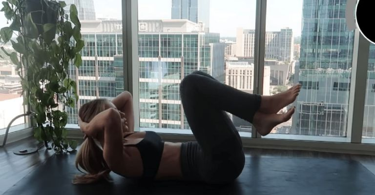
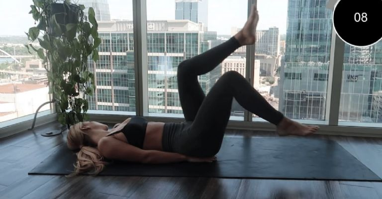
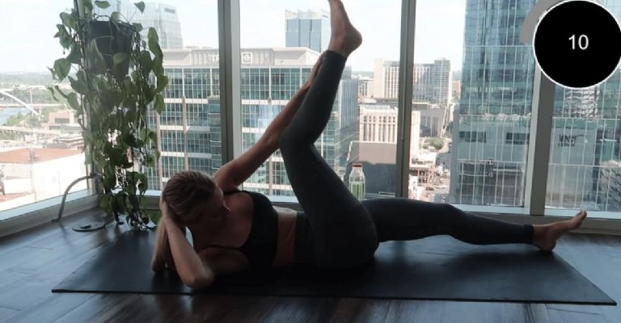
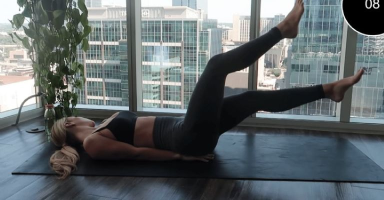
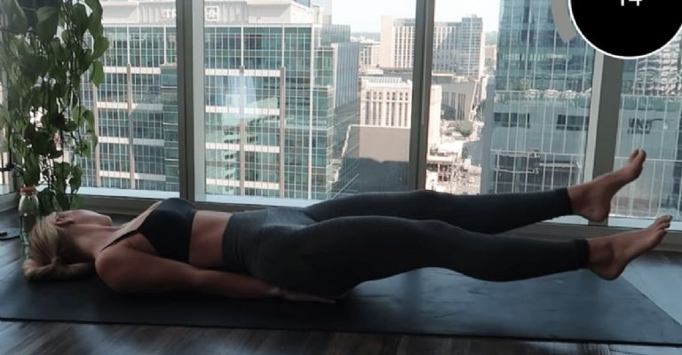

# Reference Abs Workout Report

Evidence date: `2026-04-23`

Primary locked video:

- `https://www.youtube.com/watch?v=niLch13u0sc`
- `Daisy Keech hourglass abs workout but just the exercises (with timer and breaks)`

Accepted original routine source:

- `https://www.youtube.com/watch?v=5cWxgnJgHHs`
- `Hourglass Abs Workout | 10 Minutes`

This hidden report is the illustrated judging anchor for the current benchmark
snapshot. It combines the locked watch-page resource, the recovered timer
sequence, and the local reference frames under `references/source_frames/`.

## Visual anchors

### A. Basic crunches

Timestamp hint: `00:00`

Reference frame:

Why this matters:

- knees are bent and the upper torso curls upward
- this is the cleanest crunch-family anchor in the local frame set
- the canonical order puts crunches at the start of the routine, even though
  some third-party article screenshots appear in reverse narrative order

### B. Bicycle kicks

Timestamp hint: `01:00`

Reference frame:

Why this matters:

- the legs cycle in the air with the torso still supported on the mat
- this move should not be merged into the later bicycle-crunch slot
- some hidden evidence sources are looser on naming, but the leg-pedaling
  family is still distinct

### C. Jack knives

Timestamp hint: `02:00`

Reference frame:

Why this matters:

- diagonal reach toward the raised leg is visible
- this is a more dynamic folding motion than the earlier kick-family move
- acceptable wording includes `jackknives`, `alternating jack knives`, or
  nearby `V-up` language if the same movement is clearly intended

### D. Toe taps

Timestamp hint: `04:00`

Why this matters:

- one leg is vertical and the opposite arm reaches upward
- the motion is a toe-touch / toe-tap pattern rather than a bicycle twist
- no trusted local non-thumbnail frame is stored for this slot, so judge this
  move by ordering, naming, and the candidate's own screenshots instead

### E. Scissor kicks

Timestamp hint: `06:00`

Reference frame:

Why this matters:

- alternating split-leg position is visible
- torso stays down while the legs do the work
- good answers should not collapse this into a generic leg raise

### F. Butterfly kicks / flutter kicks

Timestamp hint: `08:00`

Reference frame:

Why this matters:

- both legs are extended low above the mat
- the exercise is clearly a lower-ab kick variation, not a crunch
- this is the final lower-ab kick-family anchor in the canonical order

### G. Reverse crunches

Timestamp hint: `07:00`

Reference evidence:

- no fully trusted local frame is stored for this slot
- judge by naming, ordering, and whether the saved candidate screenshots show a
  real hip-curl / knees-to-chest reverse-crunch posture

### H. Russian twists

Timestamp hint: `03:00`

Reference evidence:

- no fully trusted local frame is stored for this slot
- judge by naming, seated twisting posture, and whether the guide keeps this as
  a distinct mid-routine slot

### I. Bicycle crunches

Timestamp hint: `05:00`

Reference evidence:

- no fully trusted local frame is stored for this slot
- judge by cross-body crunch language and distinctness from bicycle kicks

## Ordered hidden baseline

Recovered exercise order for the locked timer edit, mapped through the
official-original routine:

1. basic crunches
2. bicycle kicks
3. jack knives
4. russian twists
5. toe taps
6. bicycle crunches
7. scissor kicks
8. reverse crunches
9. butterfly kicks

Timing shape:

- approximately `60s` per move
- very short transition breaks, roughly `5s`
- the guide should read like a timer circuit, not a rep-count gym plan

## How supervisors should use this report

- Use this report together with `reference_exercise_table.csv` and
  `reference_abs_workout_guide.md`.
- Prefer semantic movement matching over exact naming.
- Give full sequence credit only when the answer recovers most of the move
  order and does not reverse the routine based on third-party screenshot
  galleries alone.
- Treat screenshot grounding as stronger when the executor's saved frames line
  up with the movement families illustrated here rather than with unrelated
  fitness imagery.
